**Professor:** [Edgar Emmanuel Vallejo Clemente](mailto:vallejo@itesm.mx)

**Team Members:** [Nisim Hurst, A01012491](mailto:A01012491@itesm.mx) 

## Introduction

### Problem description

Convenience stores usually sell commodity products to people. These products have an standard cost defined unilaterally by the manufacturer targeting all the convenience stores regardless of brand, i.e. whether they are Oxxo, 7-Eleven, Gas Stations, etc.  Also replenishment lapses are subject to the manufacturer distribution network. 

Given these constraints imposed by the multiple manufacturers, a convenience store must manage to get it through by developing a strategy usually based on one of the following key performance indicators: demand forecasting, human resource management, fiscal strategies and real estate management. For the purpose of this analysis we will focus on the former: demand forecasting. 

There are many hidden latent factors that are almost impossible to infer from the usual sales transactions data alone, such as a store's location and the manufacturers' marketing campaigns over that specific location. Thus, being able to forecast product demand is extremely useful to:

- Update the economic order quantity to reduce stock and distribution costs.
- Objectively evaluate a store's profit taking into account the forecasted demand and compare it with the other stores.
- Develop pricing strategies based on price elasticity that maximize profit.

Price elasticity is a trivial and naïve attempt to forecast demand based solely on price. Let $Q$ be current units sold, $P$ current price, $\Delta Q$ the change in quantity and $\Delta P$ change in price. Then, we define elasticity by the following formula:
$$
e_p=\frac{\Delta Q}{\Delta P}*\frac{P}{Q}
$$
This formula assumes that customers are rational beings and respond to changes in prices by changing their buying preferences proportionally to some degree. A negative elasticity coefficient evince customers buy more at less price. When it is less than -1 it is considered to be a relatively elastic demand at that point. Notice how the formula uses the current price-quantity pair to calculate the elasticity at some given level. So, in reality this formula may yield an hyperbolic convex curve rather than just a linear slope.

To calculate price elasticity from sales transactions alone is an grueling task, though. The source of these data are not controlled pricing experiments. Thus, to assume the variation in price is exogenous is way to risky and the basic assumption for parameter identification of the least square method is broken. Also, right price strategies are difficult to predict because most of the products are subject to behavioral economics variables like the [Veblen Effect](https://en.wikipedia.org/wiki/Veblen_good) [@Veblen] , i.e. when the elasticity is positive, or changes in demographics that are outside of the scope of the data. Price elasticity models are usually designed by a human and optimized by a machine, but nowadays these models are falling short behind the velocity of global economic changes.

Yet, there are still ways to forecast demand with an acceptable confidence interval. One of the most common ones is the [ARIMA model](https://en.wikipedia.org/wiki/Autoregressive_integrated_moving_average) [@Hyndman]. It stands for autoregressive integrated moving average model. The most outstanding feature of this model is that it uses the same variable at lag times for both input and output. The probability is not always assumed to be necessarily stationary so it can cope seamlessly with seasonality trends. Despite these clear advantages, using it makes more difficult to take into account other factors apart from the demand out-of-the-shelf.

[Hidden Markov models](https://en.wikipedia.org/wiki/Hidden_Markov_model) are Bayesian temporal models that can help us infer latent variables and handle product sales sequences of variable length. Nonetheless, they fall in the stationary probability assumption. Also, they fail to capture long term relationships between the data because of the Markov assumption that a future state is only dependent of the immediately previous state. Also, on Markov chains you have to find a way to compress the whole problem into one variable only.

Neural networks are deterministic models that can be used for both regression and autoregression tasks. An added advantage is that hierarchical features are unsupervisedly built from other categorical predictors without leaving behind temporal relations. Densely connected simple multilayer perceptron neural networks are good when the i.d.d. (independent and identically distributed) assumption holds. However, when data is correlated in time or space is a bit trickier to deal with.

Recurrent neural networks have emerged as an effective and scalable models for sequential data. However, they can't deal with product sales sequences of variable length. A way to overcome this limitation is by using sequence padding to the max length. Long Short-Term memory neural networks are a kind of recurrent neural that introduce a memory cell which can maintain its state over time, and non-linear gating units which regulate the information flow into and out of the cell [@Greff2017]. 

Thus, we propose a LSTM-based method that could meet all the challenges listed above. Namely, we would like to estimate units sold using an automatically learned price elasticity model.

LSTM basic elements are: 1. memory cell, 2. input gate, 3. output gate and 4. forget gate. For a complete introduction please refer to [@Greff2017].

### Questions to answer

1. **Can this dataset be used to train a recurrent neural network that produces over 60% accuracy on the predicted 1 month horizon?** Is the data sufficient? are there any bayes error bounds implicit in the data?
2. **How similar products sales relate to the data?** can we use data of one product category (human labeled) and use it to predict the units sold of another category? can we use a kind of transfer learning from other pre-trained datasets?
3. **Is there any seasonality for some products?** are there any periodic elements that would affect the units sold regardless of the other variables.
4. **How elastic are the products?**  how changes in prices and other ancillary variables affect the units sold.

Further details of the dataset where provided on a previous project proposal. However, the dataset was extracted from the article [@Hervert-Escobar2017] by Laura Hervert-Escobar of the *Instituto Tecnológico y de Estudios Superiores de Monterrey*. The original objective of this dataset was to find a pricing optimization model from some features suggested by the business's executives. The data was provided from a real retail store business, so it has some rights reserved and discretion is advised.

### Assumptions and hypothesis

We assume the following:

1. If a row doesn't appear in the dataset we assume there was no sale of that product on that day. Thus, sampling was made evenly through the year.
2. If a product haven't appeared in the series until some point of or if it doesn't appears any more since some point, the past assumption doesn't hold for those intervals.
3. There are non-workable holydays that explain the lack of data on some periods.
4. Some holyday weekends have no data for all the products, we assume we can fill those points with the last measured value per product, even if they are marked as zero.
5. Climate conditions are independent of all other variables but can be a dependable variable for units.
6. Cost is independent of all other variables but can be a dependable variable for price both internal and of the competitors.

Under this conditions, we are confident to be able to build a multivariate time series forecasting model with LSTM which can predict demand based on the following variables:

- **Input**
    - **Prices.** How changes in prices affect demand? 
    - **Cost.** Are there any suppliers trends related to time?
    - **Climate.** Can climate changes trigger or hinder sales? Are there any trends in the climate that we can predict regardless of the other variables?
- **Target**
    - **Units.** How are the units affected by all the other variables?

Each SKU is meant to be a sequence of sales for our model to predict the demand. The max sequence length is 93, i.e. the maximum number of weeks sampled.

## Methodology

### State-of-the-art review

In [@Kochak2015], the authors also took and ANN MLP approach and recomend it over other methods such as ARIMA. They observed that as forecasting periods becomes smaller, using ANN provides more accuracy in the forecast. They also had less than 2 years of data to train so, this work quite resemble ours in extensions.

In conjunction with the classical *Mean Absolute Error* (MAE), and its scaled version *Mean Absolute Percentage Error* (MAPE), we will also use the *Mean Squared Logarithmic Error* (MSLE) as proposed by [@Taghizadeh2017] which is given by the formula:

$$
\sqrt{\frac{1}{n}\sum_{i=1}^{n}(\log(p_i+1)-\log(a_i+1))^2}
$$

Where $p_i$ is the predicted value for sample $i$ and $a_i$ is the actual or real value. This metric has the advantage that even highly fluctuating unit range per SKU also give consistent results.

### Data exploration and preprocessing

The dimensions of this dataset consist on: 78578 samples, 15 features, 1030 unique sku (sequences), 70 categories. There are about 14 sku sales sequences per category. The data is spread out evenly over a period of 93 continuous weeks.

#### Seasonality trends

Autoregressive models use the data of one variable of the previous step to predict that same variable. Are the *units* feature we are trying to predict a proper feature to predict using autoregression? Well, lag plots allow to detect those kind of relationships through time in the date. Lets see how it behaves:

```{r fig1, out.width="40%", fig.align="center", fig.cap="Pandas Lag Plot", echo=FALSE}
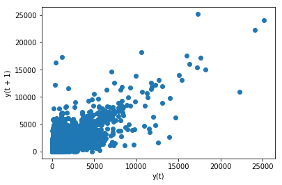
```
We can see from Figure \@ref(fig:fig1) that there is a clear linear correlation relationship that we can use to construct a regression model out of just these periodic changes in the *units* feature. 

So, we can conclude from this graph that by using the *units* predictor we will increase our models' accuracy and it favors the autoregression approach.

#### Data cleansing at column level

[^1]: This model is slightly better than a simple linear correlation and a good  explanation can be found on [stackoverflow](https://stats.stackexchange.com/questions/204141/difference-between-selecting-features-based-on-f-regression-and-based-on-r2) 

From the module `sklearn.feature_selection` we used `SelectKBest` and `f_regression` to see which other variables are important to the regression task over the *units* feature [^1] : 


|    F Score |      P Value | Support   | Attribute          |
|-----------:|-------------:|:----------|:-------------------|
| 6097.77    | 0            | True      | PROMOTION          |
| 4883.87    | 0            | True      | SYSTEM PRICE       |
| 4234.03    | 0            | True      | REAL PRICE         |
| 3680.61    | 0            | True      | NetCost            |
| 2047.72    | 0            | True      | Competitor's price |
| 1675.34    | 0            | False     | SKU                |
|  777.626   | 2.68519e-170 | False     | CATEGORY           |
|   60.0118  | 9.54124e-15  | False     | WEEK               |
|   46.0613  | 1.15421e-11  | False     | MIN TEMP           |
|    3.62565 | 0.056899     | False     | AVG TEMP           |
|    2.6292  | 0.104919     | False     | RAIN INTENSITY     |
|    1.78562 | 0.181465     | False     | MAX TEMP           |

Table: (\#tab:tab1) Features' F-Score for predicting *units* 

We can see from Table \@ref(tab:tab1) that one of the best feature to predict *units* is if the item has or hasn't *promotion*. This can be easily explain by taking into account that seller grant promotion to increase sales volume. *System price* is the second most influent variable followed by *real price* and since only 19 products have a mean absolute elasticity lower or equal than one (following a kind of Veblen effect) we can confidently say the products are **elastic**.

So, if we would like to use the orthogonalization method and reduce overfiting after achieving a good accuracy, we could just drop the features that have a low F-Score, i.e. those from *week* to *max-temp*.

Related to elasticity is cross elasticity of demand [@Frank2014]. This effect is also called cannibalization and it happens when an item begins to steal the sales of a similar item of the same category and price. Here is a list of products that may be victims of cannibalization:


| sku1 | sku2 | correlation | cat1 |  price1 |  price2 |
| ---: | ---: | ----------: | ---: | ------: | ------: |
|  793 |  797 |   -0.888922 |   20 | 14.8572 |  16.065 |
|  735 |  797 |   -0.882422 |   20 | 16.8941 |  16.065 |
| 1204 | 1209 |    -0.80364 |   30 |  17.305 | 18.3708 |
|  734 |  797 |   -0.802659 |   20 | 14.2464 |  16.065 |
| 1208 | 1209 |   -0.796488 |   30 | 20.5644 | 18.3708 |
| 1207 | 1209 |   -0.775419 |   30 | 22.4275 | 18.3708 |
|  298 |  305 |   -0.721268 |   50 | 25.5154 | 20.5474 |
| 1201 | 1206 |   -0.685368 |   30 | 15.8318 | 13.3298 |
|  745 |  797 |   -0.667326 |   20 | 13.9792 |  16.065 |
|  724 |  797 |   -0.666368 |   20 | 13.8644 |  16.065 |
|  287 |  289 |   -0.636817 |   41 | 10.0019 | 10.9023 |

Table: (\#tab:tab2) Cannibalization items

These items represent less than %0.632746 of the total sales so we can safely ignore them. An advantage of the neural network is that this kind of relationship between items are automatically learned and the only thing we must ensure is that these effect is balanced or diminished to some insignificant degree.

#### Data cleansing at row level

For each product, we have up to 93 observations, one per week. This limits the applicability of some machine
learning models which need more data. Trying to find some seasonality in the data is also difficult, since we
have less than two years of information. This leaves us with 581 out of 1030 products. All these product sequences can be trivially fed to the LSTM. However, for the other 449 products we would need some kind of padding.

An equally important observation is that data is not scaled down between 0 and 1 for a good performance of the neural network. On RNN Batch Normalization can't be used since the statistics are computed per batch, i.e. weights are shared per batch. So, we will make use of an extra prepossesing step using the *MinMaxScaler* module from the *sklearn.preprocessing* package.

## Experiments

Two approaches were tested, one generative of all the possible sequences since some starting point and the other by using just 1 step lag values. However, common parameter were set up for comparison on both approaches: 

1. *ADAM* as optimizer 
2. Default learning rate of $0.001$
3. 50 LSTM units 
4. 50 epochs
5. Batch size of 72 
6. 1 final unit of a densely connected layer was used to concentrate the output into single a regression neuron

### Approach 1. Padding sequences per SKU

[^2]: based on this [answer](https://stackoverflow.com/questions/39674713/neural-network-lstm-input-shape-from-dataframe)

The first approach [^2] generated sequences for each SKU by progressively taking more sequence elements until reaching the max sequence length. First each row is transformed into a single input vector which represents a value on the sequence. So we will start from the one that has 1 length and all zeros to the last one having all the 93 items extracted from the data. A sequence for each of the of the 1030 items, multiplied by the padding of a max length of 93 sequences gave a total of 95,790 sequences. This quantity was extremely high and training took so long that had to be cancelled. 

```{r fig3, out.width="30%", fig.align="center", fig.cap="Representation example of cummulative vectors", echo=FALSE}
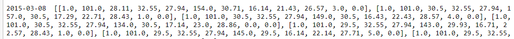
```

Then, we tried by just leaving the 581 items that have presence over all the 93 weeks. Just 581 was specially detrimental for the networks performance. Finally, we tried to filter out the items that didn't had the longest sequence per item. So, there were only 1030 sequences left for training. This quantity was also too low and didn't achieve good results.

```{r fig2, out.width="30%", fig.align="center", fig.cap="MSE for the padding approach (still too high)", echo=FALSE}
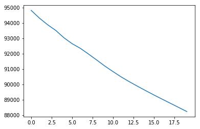
```
That approach didn't gave good results so there was no point in exploring it further.

### Approach 2. Using lag values of a previous state 

[^3]: based on this [blog](https://machinelearningmastery.com/multivariate-time-series-forecasting-lstms-keras/)

The second approach [^3] was to treat each transaction record as a sequence composed by the immediately previous record for that item. Thus, we will have a 2 states fixed length sequence for each record. Having 13 predictors this yields a total of 25 features, the ones of the previous and the ones of the current state excluding the units that is the variable we are trying to predict. 

```{r fig4, out.width="50%", fig.align="center", fig.cap="Horizontal stack of two consecutive sales records for a given product, already normalized between 0 and 1", echo=FALSE}
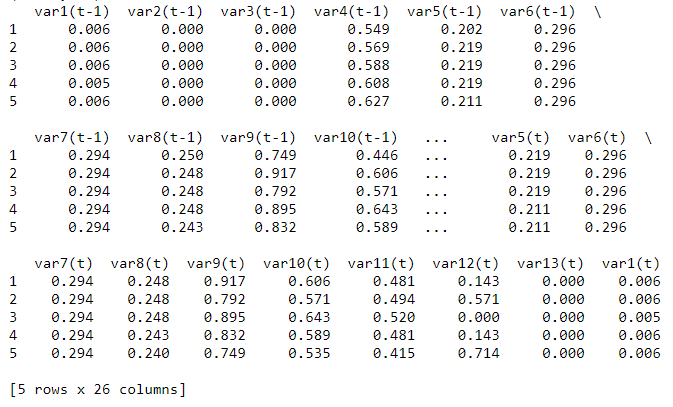
```

Figure \@ref(fig:fig4) show the representation already scaled using the *MinMaxScaler* function and horizontally stacked for the first 5 pairs of sequences. Coincidentally they belong to the same item.

Given that this problem is about regression we cant user stratified K-Fold. So, the most we can do is to split the dataset randomly several times and average their results.

A first test was made by calculating the lag on each separated *SKU*, assuming distinct *SKU's* would have distinct trends. However, by doing this we inadvertently filtered out all the product sales records that didn't had a previous record. So, from a total of 78578 records it leave us with only 77548 (-1030). These were the results:

```{r fig5, out.width="100%", fig.align="center", fig.cap="Results between train a validation sets for several metrics", echo=FALSE}
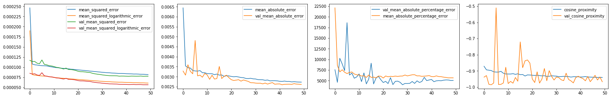
```
```{r fig6, out.width="100%", fig.align="center", fig.cap="Box plots for analysis of variance over 10 random splits", echo=FALSE}
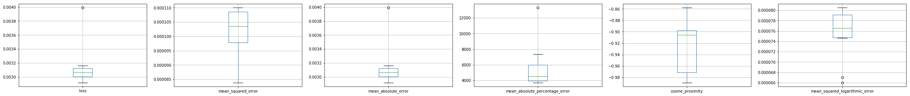
```

From Figure \@ref(fig:fig5) we see that the data is sufficient to generate a learning curve that shows 20 epochs would be enough for the network to learn temporal relationships. From the boxplots we see that surprisingly, the most stable accuracy measure is the MSE.  The median MSE value is considerably lower than the one achieved by the first approach, i.e. 8800 vs 0.0001. 

```{r fig7, out.width="80%", fig.align="center", fig.cap="1. Prediction over all SKU units; 2. one item and; 3. the same item with a price increase of 10 perc.", echo=FALSE}
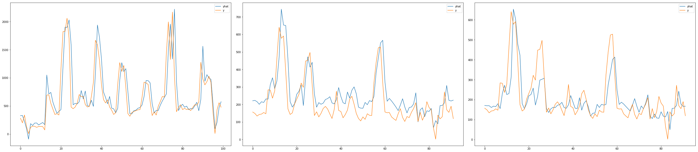
```
The left most tile of Figure \@ref(fig:fig7) shows the prediction for all the items demand over the full range of 93 weeks, then for only one product and finally for the same product but with a 10% price increase. We can see our hypothesis that a LSTM can help us build a successful elasticity model is confirmed. On the general prediction we see that the predicted units are close to the real units and is yielding results comparable to ARIMA of Figure \@ref(fig:fig8) for $\frac{1}{3}$ of the weeks, i.e. 32 samples.

```{r fig8, out.width="30%", fig.align="center", fig.cap="$(5,1,0)$ ARIMA reference model for the sum of the units un the last third of the data", echo=FALSE}
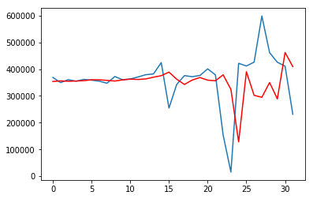
```

The other 2 predictions by product show how the model is capturing elasticity relationships that are directly reflected on the predicted *units* to be sold.

We also tried to remove the SKU column and predict by just the other variables:

```{r fig9, out.width="70%", fig.align="center", fig.cap="Side-by-side comparison between training by SKU and training by category", echo=FALSE}
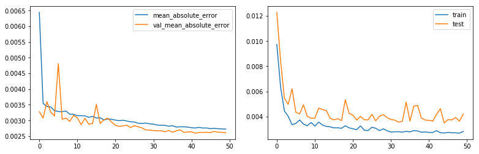
```

The left hand side image of Figure \@ref(fig:fig9) is the same learning curve using *SKU* and the other side is the one that just has the other columns except *SKU*. We can see they still remain on the same order of magnitude even though the one that used the *SKU* has a lower MAE because it is using particular trends of each *SKU*.

Finally, we tried to test what amount of loss could reduced by using one more time step of lag values for the series[^4] :

[^4]: A total of two timesteps that remove 2060 records from the dataset. Train on 51267 samples, validate on 25252 = 76519

```{r fig10, out.width="50%", fig.align="center", fig.cap="Second representation with more timesteps in the same row", echo=FALSE}
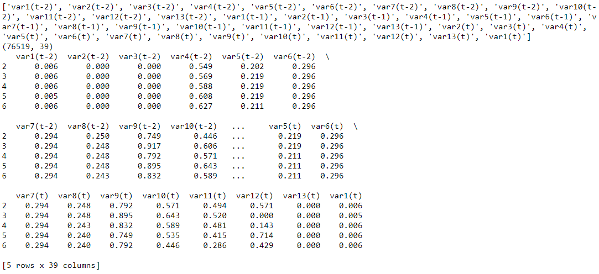
```

```{r fig11, out.width="100%", fig.align="center", fig.cap="Results with a timestep of 2", echo=FALSE}
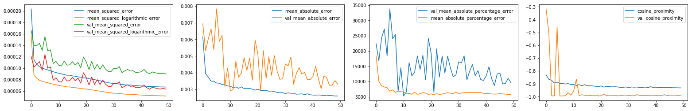
```

Figure \@ref(fig:fig11) shows extremely similiar results were obtained between the previous 1-timestep test and the actual  2-timesteps test, yielding the same order of magnitude for each metric used. Nonetheless, we see a surprising behavior in which the variance of *MAE* and *MAEP* increases for the test set. However, due lack of time, we didn't get to do variance analysis to validate if the those steep jumps remains over all the training splits.

### Implementation details

The Keras python notebook implementation was tested using a Quadro M500M with 384 CUDA cores at 1080MHz with 2GB memory and 1 CPU of 2.81 GHz. The whole process took about 1 hour 40 minutes to train (8 seconds per epoch over 50 epochs times 10 random splits).

## Results discussion

Here is a summary of some important empirical observations based on the previous \nameref{experiments} section:

1. Dimensionality reduction was never required because the difference between training and validation sets performance wasn't too important. However, maybe feature work could focus on varying the number of epochs to a bigger order of magnitude and see if it is convenient. 
2. A lag plot evinced that this task could be neatly treated using an auto regression approach, so we tried  a  naïve ARIMA. However, by considering all the other predictors, on the current and on the previous time step, LSTM was able to outperform ARIMA.
3. The first approach of generating vector embedding's concatenating the values of each row and then stack them by item to predict *units* hinted a deficiency in the method used. This can be explained by the fact that we drastically reduced the total number of samples that were fed into the LSTM from roughly $7.8*10^4$ to 1030.
4. The second approach yielded better results almost immediately, even with less epochs. It was verified that just relying on the previous state was sufficient to detect short term temporal relations, so using a hidden Markov model would probably have given similar results.
5. Random splits showed that the most consistent metric to use was *MAE*, confirming our state-of-the-art review.
6. Including the SKU predictor on the training features yielded slightly better loss results, but not much  significant, just about 20% better on *MAE* but the learning curve retained the same shape.
7. Including more timesteps in the representation gave contradictory results. We would expect more accurate predictions, however the variance of some of *MAE*  and *MAPE* metrics (our champions by the way) just go through the roof. This suggest further examination of this phenomenon with more epochs or varying the hyperparameters is required.

## Conclusions

In this work successfully predicted demand units from the previous time step and all the other available variables using an LSTM and achieving a competitive result of on $3*10^{-4}$ *MAE*. We empirically corroborate, that even when the available data wasn't covering too much time (only 93 weeks), the LSTM performed better than ARIMA as suggested in the paper of [@Kochak2015].

An elasticity model was able to be inferred from the data even when there is a small percent of items that are subject to the cannibalization effect (about 16 of 1030). This elasticity model was proven to respond as expected given a 10% point price increase.

Thus, this model can be used confidently in online prediction of *unit's* demand given the assumption that missing values in the data are properly filled by the last known *units* quantity, lest the model learns an unexplainable leap from zero to some arbitrary level.

## References

